# Chitara — AI Music Generation Platform

A Django 5.2 web application for generating AI-powered music using the Strategy Pattern, supporting both a local mock backend and the real Suno API.

---

## Tech Stack

| Layer | Technology |
|-------|-----------|
| Backend | Python 3.11, Django 5.2 |
| Auth | django-allauth 0.61+ (username/email + Google OAuth) |
| Database | SQLite (development) |
| HTTP | requests, gunicorn |
| Crypto | cryptography, PyJWT |
| Config | python-dotenv |

---

## Quickstart

### Step 1 — Copy the environment file

```bash
cp chitara/.env.example chitara/.env
```

### Step 2 — Edit `chitara/.env`

Open the file and fill in any values you need:

| What you want | What to set |
|---|---|
| Offline / mock mode (default) | Nothing — defaults work out of the box |
| Real Suno AI generation | `GENERATOR_STRATEGY=suno` + `SUNO_API_KEY=<your key>` + `SUNO_CALLBACK_URL=<ngrok URL>` |
| Google OAuth login | `GOOGLE_CLIENT_ID` + `GOOGLE_CLIENT_SECRET` |

### Step 3 — Create and activate a virtual environment

```bash
cd chitara

python -m venv venv
# Windows
venv\Scripts\activate
# Mac/Linux
source venv/bin/activate
```

### Step 4 — Install dependencies

```bash
pip install -r requirements.txt
```

### Step 5 — Run migrations

```bash
python manage.py migrate
```

Genres, Moods, Occasions, Themes and SingerModels are seeded automatically on first startup — no extra commands needed.

### Step 6 — (Optional) Create an admin account

```bash
python manage.py createsuperuser
```

Then log in at [http://localhost:8000/admin](http://localhost:8000/admin).

### Step 7 — Start the server

```bash
python manage.py runserver
```

Then open: [http://localhost:8000](http://localhost:8000)

---

## Environment Variables

All variables live in `chitara/.env`. A template with every key is provided in
`chitara/.env.example` — copy it before doing anything else.

| Variable | Required | Default | Description |
|----------|----------|---------|-------------|
| `GENERATOR_STRATEGY` | No | `mock` | `mock` for offline dev, `suno` for real API |
| `SUNO_API_KEY` | If Suno | — | API key from sunoapi.org |
| `SUNO_CALLBACK_URL` | If Suno | — | Your ngrok HTTPS URL + `/songs/api/callback/` |
| `SUNO_API_BASE_URL` | No | `https://api.sunoapi.org/api/v1` | Suno endpoint |
| `SUNO_API_TIMEOUT` | No | `30` | Request timeout in seconds |
| `GOOGLE_CLIENT_ID` | No | — | Google OAuth app client ID |
| `GOOGLE_CLIENT_SECRET` | No | — | Google OAuth app client secret |

---

## Project Structure

```
Chitara/
├── diagrams/                           # UML diagrams (domain model, class, sequence)
└── chitara/
    ├── manage.py
    ├── requirements.txt
    ├── .env                            # local secrets — never commit
    ├── .env.example
    ├── populate_initial_data.py        # optional manual seed script
    ├── populate_suno_models.py         # optional manual seed script
    ├── demo_strategy.py                # strategy pattern demo script
    ├── chitara/                        # Django project settings
    │   ├── settings.py
    │   ├── urls.py
    │   └── wsgi.py
    └── music/                          # main app — one class per file
        ├── models/                     # Song, Genre, Mood, Occasion, Theme, SingerModel, Feedback
        ├── views/                      # SongGenerationView, LibraryView, DetailView, …
        ├── services/                   # SongGenerationService, SongLibraryService
        ├── repositories/               # SongRepository
        ├── suno_client/                # SunoAPIClient, APIError
        ├── admin/                      # per-model admin registrations
        ├── apps.py                     # MusicConfig — auto-seeds lookup data on startup
        ├── strategies/
        │   ├── base.py                 # abstract SongGeneratorStrategy (ABC)
        │   ├── factory.py              # StrategyFactory — reads GENERATOR_STRATEGY
        │   ├── mock_strategy.py        # offline / deterministic
        │   ├── suno_strategy.py        # real Suno API + async polling
        │   └── exceptions.py
        ├── forms.py
        ├── urls.py
        └── templates/
```

---

## Domain Models

| Model | Description |
|-------|-------------|
| `Song` | AI-generated track with all generation parameters |
| `SingerModel` | Vocal type selected during generation (Soprano, Alto, etc.) |
| `Genre` | Musical genre (Pop, Rock, Jazz, …) |
| `Mood` | Emotional tone (Happy, Energetic, Calm, …) |
| `Occasion` | Song context (Party, Wedding, Workout, …) |
| `Theme` | Optional tag, many-to-many with Song (Summer, Love, …) |
| `Feedback` | User-submitted feedback after generation |

Admin panel at `/admin` supports full CRUD on all models.

---

## Architecture Diagrams

### Domain Model
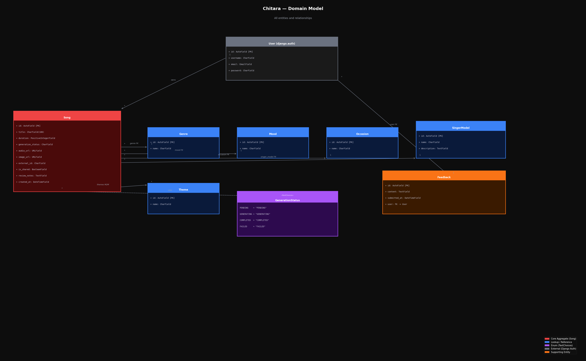

### Class Diagram
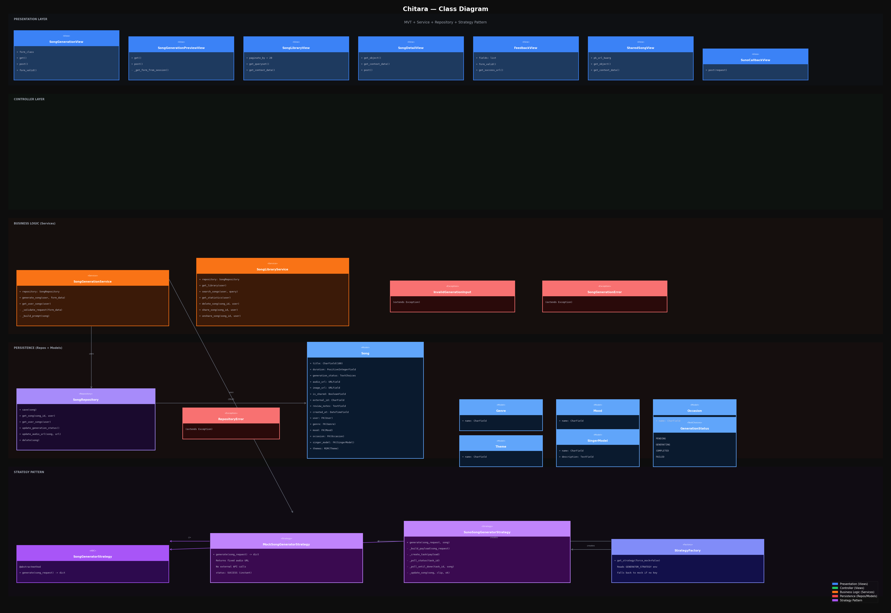

### Sequence Diagram — Song Generation Flow
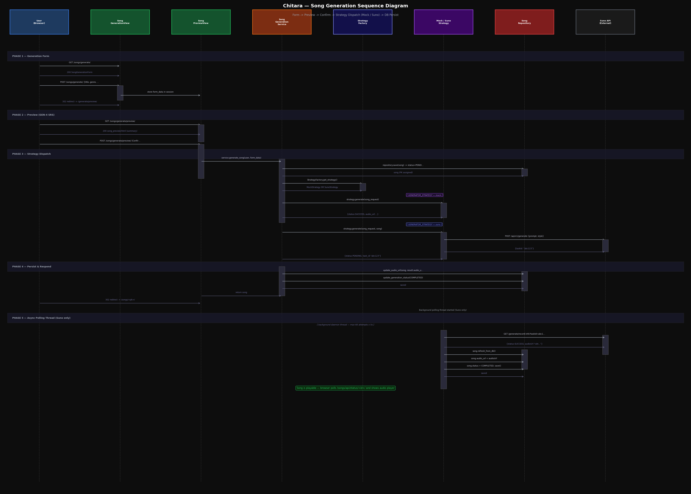

---

## Strategy Pattern (Song Generation)

Song generation is decoupled from the rest of the app via the Strategy Pattern.

| Strategy | Class | Use when |
|----------|-------|----------|
| Mock | `MockSongGeneratorStrategy` | Local dev, offline, testing |
| Suno | `SunoSongGeneratorStrategy` | Real AI generation via sunoapi.org |

Switch strategy with one line in `.env`:

```env
GENERATOR_STRATEGY=mock   # or: suno
```

```
SongGeneratorStrategy (ABC)
├── MockSongGeneratorStrategy   → instant, deterministic
└── SunoSongGeneratorStrategy   → async polling, real API

StrategyFactory.get_strategy() → correct instance based on env var
```

### Suno Setup (real API)

Suno's callback requires HTTPS, so use ngrok locally:

```bash
# Terminal 1
ngrok http 8000
# copy the https URL, e.g. https://abc123.ngrok-free.app

# .env
GENERATOR_STRATEGY=suno
SUNO_API_KEY=your_key_here
SUNO_CALLBACK_URL=https://abc123.ngrok-free.app/songs/api/callback/

# Terminal 2
python manage.py runserver
```

---

## URL Map

| URL | Description |
|-----|-------------|
| `/` | Landing page |
| `/accounts/login/` | Login (username/email or Google) |
| `/songs/` | Your song library |
| `/songs/generate/` | Generate a new song |
| `/songs/<pk>/` | Song detail / status |
| `/songs/shared/<id>/` | Publicly shared song (no login) |
| `/songs/feedback/` | Submit feedback |
| `/songs/api/callback/` | Suno webhook endpoint |
| `/admin/` | Django admin |

---

## Running the Strategy Demo

```bash
cd chitara
python demo_strategy.py
```

Prints Mock output, Factory selection, and (if `SUNO_API_KEY` is set) a live Suno call.

---

## Screenshots

### Home
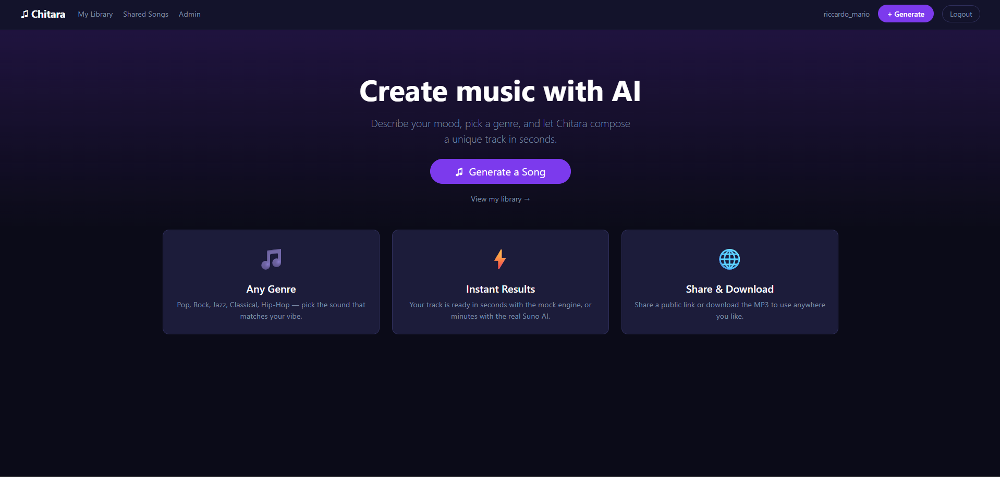

### Login
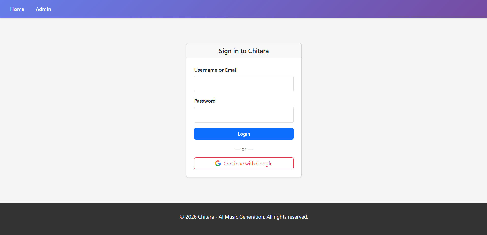

### Google Login
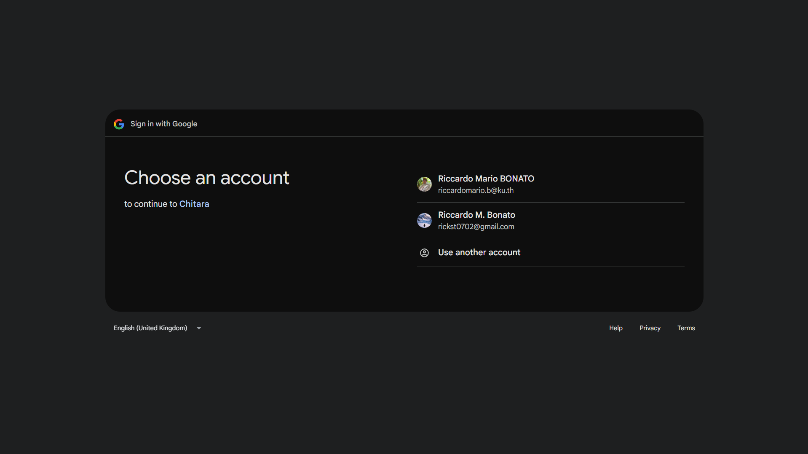

### Library
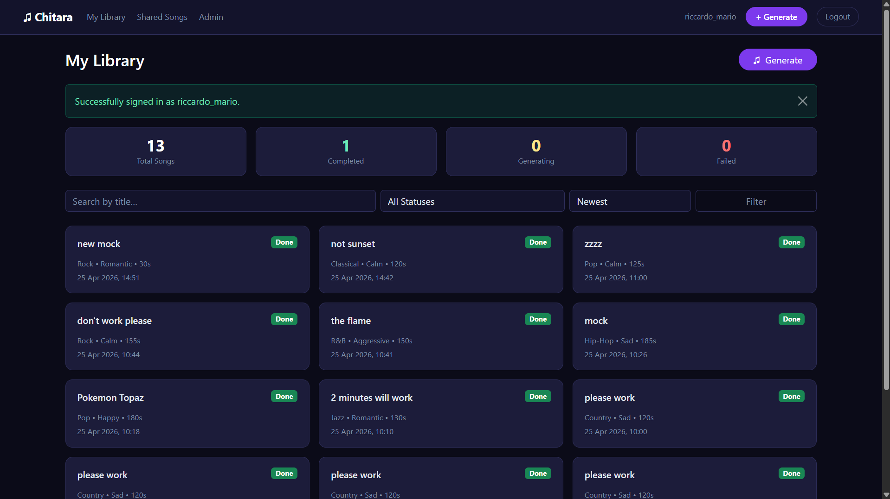

### Select
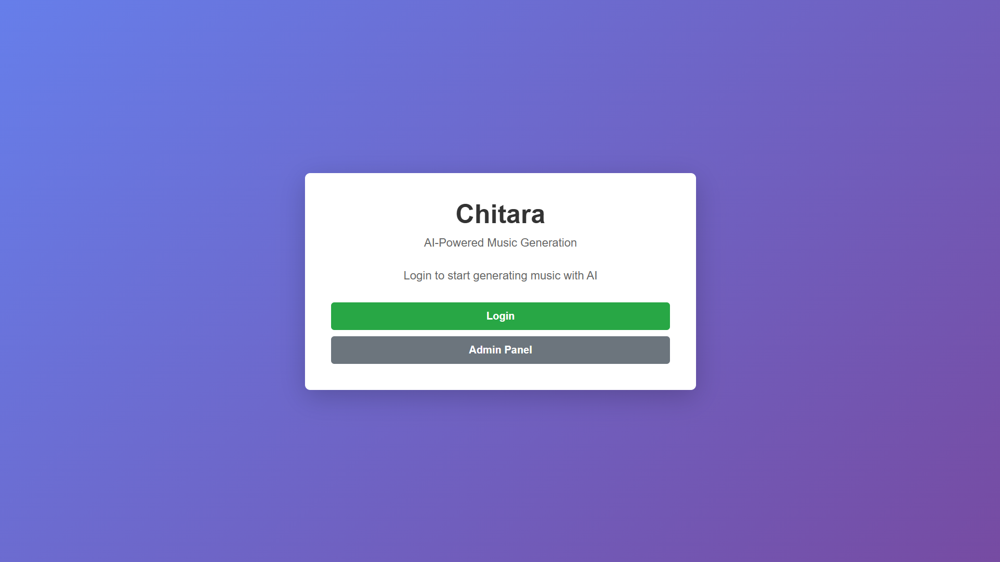

### Generate Song
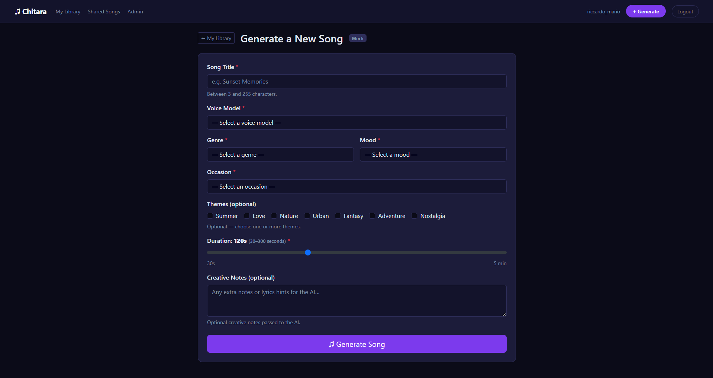

### Play Song
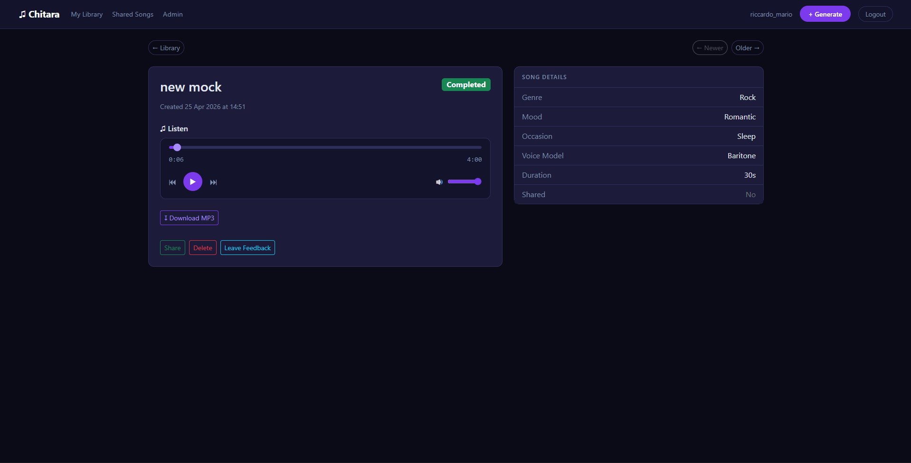

### Download Song
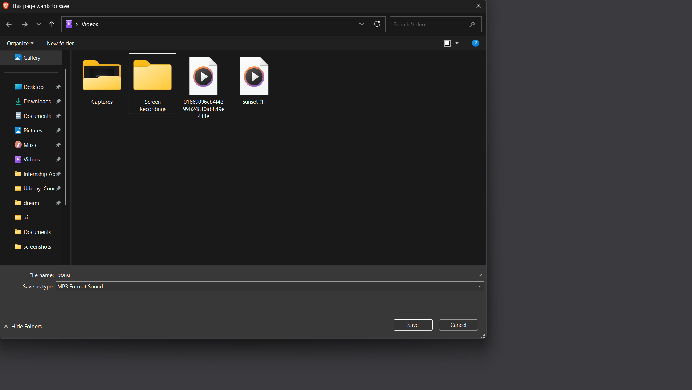

### Share Song
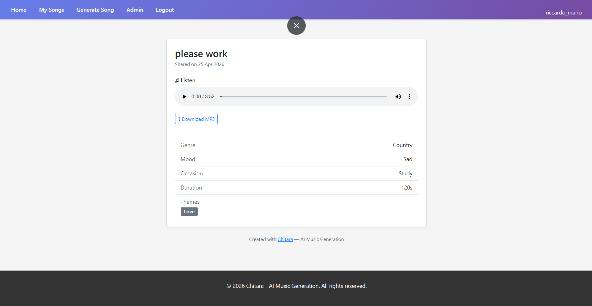

### Signout
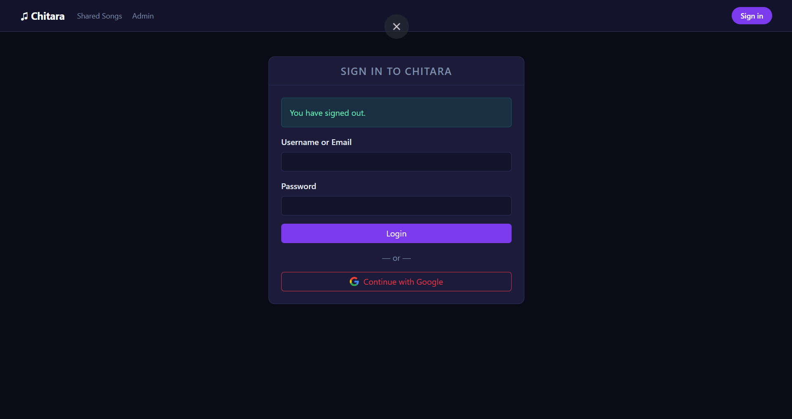

### Admin Login
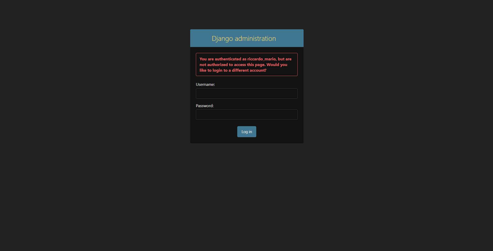

### Admin CRUD 1
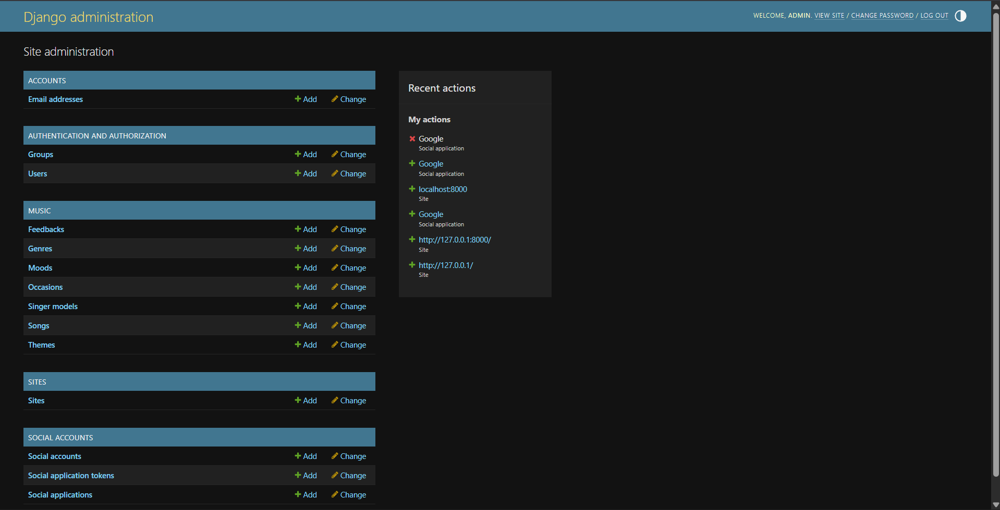

### Admin CRUD 2
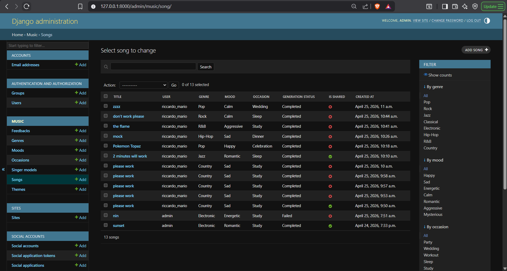

### Admin CRUD 3
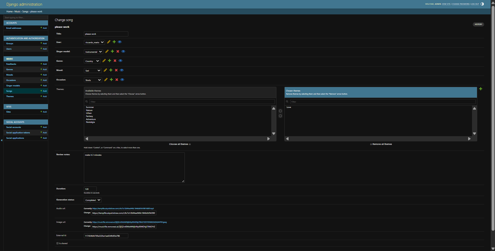
